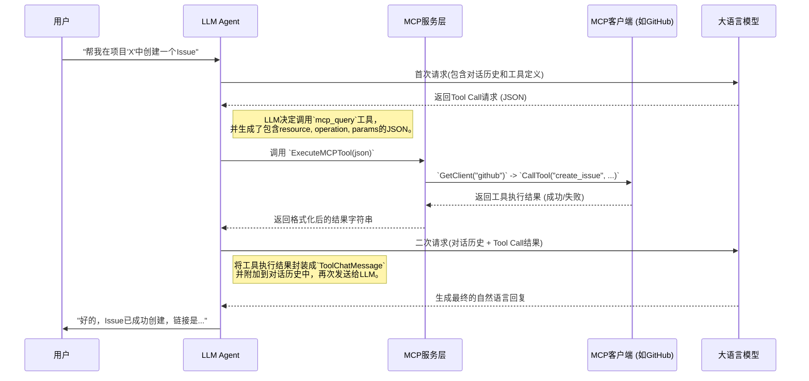

# LLM Agent 与 MCP 服务器交互工作流详解

本文档旨在详细阐述 LLM Agent 如何与 MCP（Mark3Labs Control Protocol）服务器进行发现、决策和执行的完整工作流程。理解这一流程对于掌握我们系统的核心至关重要。

---

## 🎯 整体工作流程图 (Mermaid)

为了更直观地理解，我们首先通过一个序列图来展示整个交互过程：



---

## 1. 核心问题一：LLM 如何发现可用的 MCP 客户端与工具？

LLM Agent 本身是无状态的，它不知道外界有哪些可用的工具。因此，系统在每次与 LLM 交互前，都必须动态地告诉 LLM“你能做什么”。这个过程的核心在于构建一个详尽的工具描述，让 LLM 能够理解。

**关键函数：** [`internal/llm/tools.go`](internal/llm/tools.go:0) 中的 `MCPTools()`

此函数负责动态生成一个名为 `mcp_query` 的工具定义，其工作流程如下：

1.  **获取所有已注册的客户端**

    -   通过调用 `service.GetRegisteredClientNames()`，系统会获取到一个当前所有已连接并成功注册的 MCP 客户端名称列表（例如 `["github", "jira", "database"]`）。

2.  **遍历并查询每个客户端的工具**

    -   系统会遍历这个名称列表。
    -   对于每个客户端名称，它会调用 `service.GetClient(clientName)` 来获取该客户端的实例。
    -   然后，通过 `mcpClient.ListTools()` 方法，获取该客户端所提供的所有工具的详细信息（工具名、描述、参数等）。

3.  **构建工具描述字符串**

    -   这是最关键的一步。系统会将所有客户端及其工具的信息，聚合成一个长长的、人类可读的描述字符串。这个字符串是 LLM 理解工具能力的主要依据。
    -   **示例描述结构：**

        ```text
        This tool allows you to interact with various MCP (Mark3Labs Control Protocol) clients.
        To use this tool, you must provide a JSON object with 'resource', 'operation', and 'params' fields.

        Available MCP clients (resources) and their operations:

        - Client 'github': A tool for interacting with GitHub.
          - Operation 'create_issue': Creates a new issue. Parameters: owner (string), repo (string), title (string), body (string).
          - Operation 'get_pull_request': Retrieves details of a pull request. Parameters: owner (string), repo (string), pullNumber (number).

        - Client 'jira': A tool for interacting with Jira.
          - Operation 'create_ticket': Creates a new ticket. Parameters: project (string), summary (string), description (string).

        ... and so on for all other clients.
        ```

4.  **嵌入到 LLM 的工具定义中**
    -   最后，这个精心构建的描述字符串会被赋值给 `llms.FunctionDefinition` 结构体的 `Description` 字段。
    -   这样，当 LLM Agent 向 LLM 发起请求时，LLM 就会在它的“工具箱”里看到一个名为 `mcp_query` 的强大工具，并且通过阅读其描述，精确地知道可以调用哪些客户端（`resource`）、执行哪些操作（`operation`），以及需要提供哪些参数（`params`）。

---

## 2. 核心问题二：LLM 如何决定调用哪个工具并生成命令？

当 LLM 接收到用户的请求后，它会利用其强大的自然语言理解能力，将用户的意图与它所知道的工具描述进行匹配。这个过程被称为 **"Function Calling"** 或 **"Tool Calling"**。

1.  **决策过程**

    -   当用户输入“帮我用 github 创建一个 issue”时，LLM 会分析这个句子。
    -   它会在所有可用工具的描述中进行查找，发现 `mcp_query` 工具的描述里提到了 `github` 客户端和 `create_issue` 操作。
    -   LLM 判断出用户的意图与这个工具的功能高度匹配，因此决定“调用”这个工具。

2.  **生成结构化命令 (JSON)**
    -   LLM 本身不执行任何代码。它的“调用”行为，实际上是生成一个结构化的 JSON 对象，该对象遵循了工具描述中定义的格式。
    -   LLM 会从用户的对话中提取执行该操作所需的所有参数。
    -   **示例 JSON 输出：**
        ```json
        {
            "resource": "github",
            "operation": "create_issue",
            "params": {
                "owner": "mark3labs",
                "repo": "travel-u",
                "title": "New Feature: Add dark mode",
                "body": "User requested to add a dark mode to the application."
            }
        }
        ```
    -   这个 JSON 对象就是 LLM 给系统下达的明确指令，精确地告诉系统要使用哪个客户端、执行哪个操作，以及附带的所有参数。

---

## 3. 核心问题三：系统如何执行调用，整合结果，并生成最终回复？

收到 LLM 返回的 JSON 指令后，系统需要执行这个指令，并将结果反馈给 LLM，让它完成与用户的最终对话。

**流程协调者：** [`internal/llm/agent.go`](internal/llm/agent.go:0) 中的 `HandleToolCallAndRespond()`

**核心执行者：** [`internal/llm/tools.go`](internal/llm/tools.go:0) 中的 `ExecuteMCPTool()`

1.  **执行工具调用 (`ExecuteMCPTool`)**

    -   该函数接收 LLM 生成的 JSON 字符串作为输入。
    -   **解析 JSON：** 它首先将 JSON 字符串反序列化，提取出 `resource`, `operation`, 和 `params`。
    -   **定位 MCP 客户端：** 使用 `service.GetClient(resource)` 来获取之前已注册的、对应的 MCP 客户端实例。
    -   **与 MCP 服务器通信：** 调用 `mcpClient.CallTool(operation, params)` 方法。这会触发真正的底层通信（例如通过 Stdio 或 SSE），将请求发送给对应的 MCP 服务器。
    -   **处理返回结果：** MCP 服务器执行完毕后会返回结果。`ExecuteMCPTool` 会捕获这个结果（无论是成功的数据还是错误信息），并将其格式化为一个简单的字符串，例如 `Tool execution successful: {"issue_url": "http://..."}` 或 `Tool execution failed: Invalid repository name`。

2.  **整合结果并再次请求 LLM (`HandleToolCallAndRespond`)**

    -   `HandleToolCallAndRespond` 函数接收到 `ExecuteMCPTool` 返回的结果字符串。
    -   **封装结果消息：** 它将这个结果字符串封装到一个特殊的 `llms.ToolChatMessage` 对象中。这个对象的作用是告诉 LLM：“这是你之前请求调用的那个工具的执行结果。”
    -   **更新对话历史：** 最关键的一步！这个 `ToolChatMessage` 会被添加到当前的对话历史（memory）中，紧跟在 LLM 的 Tool Call 请求之后。
    -   **发起二次请求：** `HandleToolCallAndRespond` 会将**更新后**的完整对话历史（包含了用户的原始问题、LLM 的工具调用决策、以及工具的执行结果）再次发送给 LLM。

3.  **生成最终回复**
    -   LLM 现在收到了一个更完整的上下文。它看到了自己之前的决策（“我要调用 GitHub 工具”）以及该决策的结果（“工具调用成功，新的 Issue 链接是...”）。
    -   基于这个包含工具结果的全新上下文，LLM 会进行“思考”，并生成一个自然的、面向用户的最终文本回复。
    -   **最终回复示例：** “好的，我已经成功在 GitHub 上为您创建了 Issue。您可以通过这个链接查看：[https://github.com/mark3labs/travel-u/issues/123](https://github.com/mark3labs/travel-u/issues/123) 😊”

这个闭环流程确保了 LLM 不仅能决定做什么，还能了解到事情做得怎么样，并基于此与用户进行流畅、智能的交互。
